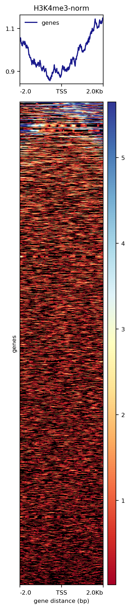

## Introduction

When working with epigenetic data, a lot of information about the nature of epigenetic marks and its association with gene architecture can be obtained. Specifically in genome loci like promoters and enhancers, looking for these epigenetic marks can elucidate their function as marks alter chromatin structure and DNA accessibility. Promoters for instance are sequences near genes that are needed for the transcription process to begin and therefore, for gene activation (NIH, 2022). On the other hand, enhancers are also regulatory sequences which bind transcription factors and are located upstream or downstream from an associated gene (Scitable, 2022).

In this report we study the epigenetic mark H3K4me3 which occurs at transcription start sites (Liu et. al, 2016) and we want to know if it is indeed enriched in promoter sequences. We use interaction data table from the supplemental Data 1 of the study the “Lineage-Specific Genome Architecture Links Enhancers and Non-coding Disease Variants to Target Gene Promoters”, where we used the file `ActivePromoterEnhancerLinks.tsv` which is a table of all the interactions detected between fragments that contain active promoter and enhancer elements from various hematopoietic cells. This files contains a few colums with the genome positions that are promoters and a few columns for genome positions with enhancers, every row also states the type of cell this is taken from.

Since we are interested in enrichment of the H3K4me3 mark, we need its bigwig signal files of this mark, which can be found in Blueprint.

#### Blueprint pipeline

Starting with fastq file from ChIP-seq experiment of H3K4me3 in erytrhoblasts. Mapping was performed with bwa 0.7.7 to the reference genome GRCh38. BAM files are sorted and duplicates were marked using picard. Data is filetered discarding unmapped reads and those with mapping quality less than 5 using samtools 0.1.19 and then re-filtered to remove PCR or optical duplicate reads. Fragment size is then modelled using a PhantomPeakQualTools R script. Peaks were called using MACS2 (2.0.10.20131216) using predicted fragment sizes and avoiding the -broad flag for H3K4me3 marks. bigWigs are produced using align2RawSignal using the fragment size predicted by PhantomPeakQualTools.

#### Histone enrichment analysis

We chose H3K4me3 because, since we are analysing these marks in erythrobalsts cells, which are precursor cells of erythrocytes, it would be interesting to see the landscape of the active genes in these pre-state cells. Since H3K4me3 is found in the 5' region of genes and is associated with transcriptional regions, then the analysis of these marks can be a useful tool for out landscape visualization.

#### Data download and processing

Downloading list of all interactions detected of active promoters and enhancers.

```{bash eval = F}
qlogin
cd /mnt/Timina/bioinfoII/ssalazar/epigenomics/data
wget https://www.cell.com/cms/10.1016/j.cell.2016.09.037/attachment/5bc79f6f-1b69-4192-8cb8-4247cc2e0f39/mmc4.zip
```


Downloading signal files (bigWig) from bluePrint

```{bash eval = F}
wget http://ftp.ebi.ac.uk/pub/databases/blueprint/data/homo_sapiens/GRCh38/cord_blood/S002R5/erythroblast/ChIP-Seq/NCMLS/S002R5H1.ERX300721.H3K4me3.bwa.GRCh38.20150528.bw

wget http://ftp.ebi.ac.uk/pub/databases/blueprint/data/homo_sapiens/GRCh38/cord_blood/S002S3/erythroblast/ChIP-Seq/NCMLS/S002S3H1.ERX300734.H3K4me3.bwa.GRCh38.20150528.bw

wget http://ftp.ebi.ac.uk/pub/databases/blueprint/data/homo_sapiens/GRCh38/cord_blood/S002R5/erythroblast/ChIP-Seq/NCMLS/S002R5H1.ERX337057.Input.bwa.GRCh38.20150528.bw

wget http://ftp.ebi.ac.uk/pub/databases/blueprint/data/homo_sapiens/GRCh38/cord_blood/S002S3/erythroblast/ChIP-Seq/NCMLS/S002S3H1.ERX337056.Input.bwa.GRCh38.20150528.bw
```

Filtering the interaction list and getting two different bed files, one for promoters and one for enhancers
```{bash eval = F}
grep "Ery" ActivePromoterEnhancerLinks.tsv | awk '{ print $1, $2, $3 }' | sed -e 's/ /\t/g' > promotersEry.bed

grep "Ery" ActivePromoterEnhancerLinks.tsv | awk '{ print $5, $6, $7 }' | sed -e 's/ /\t/g' > enhancersEry.bed
```

We need to change the positions on the bed files since they are based on the GRCh37 reference genome version according to the article, and the bigWig files from Blueprint are based on the GRCh38 reference genome. 

We first download the liftover chains to go from Hg19 to Hg38

```{bash eval = F}
wget https://hgdownload.cse.ucsc.edu/goldenpath/hg19/liftOver/hg19ToHg38.over.chain.gz
```

Then we use the `liftOver` tool from the UCSC module to do the conversion.

```{bash eval = F}
module load UCSC-executables/ucsc
liftOver promotersEry.bed hg19ToHg38.over.chain.gz promoters38.bed notpassed-promoters38Ery.bed
liftOver enhancersEry.bed hg19ToHg38.over.chain.gz enhancers38.bed notpassed-enhancers38Ery.bed
```

We get the regions that could be converted in files `promoters38.bed` and `enhancers38.bed` and the regions that had issues passed from one genome to another in the `notpassed-promoters38Ery.bed` and `notpassed-enhancers38Ery.bed` files. For both of the not passed files we have only two regions.


#### Is there an enrichment for H3K4me3 histone in the promoters or in the enhancers?

We change the files name to shorter names.

```{bash eval = F}
mv S002R5H1.ERX300721.H3K4me3.bwa.GRCh38.20150528.bw H3K4me3-male.bw
mv S002S3H1.ERX300734.H3K4me3.bwa.GRCh38.20150528.bw H3K4me3-female.bw
mv S002R5H1.ERX337057.Input.bwa.GRCh38.20150528.bw input-male.bw
mv S002S3H1.ERX337056.Input.bwa.GRCh38.20150528.bw input-female.bw
```


First we normalize our signals with the Chip-seq input available in Blueprint.

```{bash eval = F}
bigwigCompare -b1 H3K4me3-female.bw -b2 input-female.bw -o norm-H3K4me3-female.bw
bigwigCompare -b1 H3K4me3-male.bw -b2 input-male.bw -o norm-H3K4me3-male.bw
```

Then we merge both male and female signal normalized files. The following merge steps were performed as stated in the following tutorial: https://www.biostars.org/p/176875/

```{bash eval = F}
bigWigMerge norm-H3K4me3-male.bw norm-H3K4me3-female.bw norm-H3K4me3-merged.bedGraph
awk 'NR!=1' norm-H3K4me3-merged.bedGraph | sort -k1,1 -k2,2n > H3K4me3-sorted.bedGraph
awk '{print $1,$2,$3,$4}' OFS="\t" H3K4me3-sorted.bedGraph > H3K4me3-sorted2.bedGraph
```

Since the previous commands give us a bedGraph output, we then convert it to a bigwig file.

```{bash eval = F}
wget https://www.encodeproject.org/files/GRCh38_EBV.chrom.sizes/@@download/GRCh38_EBV.chrom.sizes.tsv
bedGraphToBigWig H3K4me3-sorted2.bedGraph GRCh38_EBV.chrom.sizes.tsv H3K4me3-norm.bw
```

Computing matrix with `deepTools`, using the `reference-point` sub-command since it refers to a position within a BED region and can plot us regions upstream and downstream of said position. In this case, we are using the promoters and the enhancers as reference positions, so we run this command for each of these bed files.

```{bash eval = F}
computeMatrix reference-point -S H3K4me3-norm.bw -R promoters38.bed --referencePoint center -a 2000 -b 2000 -o norm-promoter-mat.tab.gz
computeMatrix reference-point -S H3K4me3-norm.bw -R enhancers38.bed --referencePoint center -a 2000 -b 2000 -o norm-enhancer-mat.tab.gz
plotHeatmap -m norm-promoter-mat.tab.gz -o norm-promoter-heatmap.png
plotHeatmap -m norm-enhancer-mat.tab.gz -o norm-enhancer-heatmap.png
```

The heatmaps generated were the following.

Heatmap for enhancers:

```{r echo=FALSE, out.width='100%', out.height='50%'}

```

Heatmap for promoters:

```{r echo=FALSE, out.width='100%', out.height='50%'}

```

We then start our statistical tests for enrichment and visualizations using R.

```{bash eval = F}
module load r/3.5.2
R
```

With the following commands, we get the average of each row in the matrix, which are positions. With this we can get the average enrichment for each position and we can save it in a vector. One vector for promoters (`promoters.val`) and one for enhancers (`enhancers.val`).

```{r eval = F}
promoter.data <- read.delim("norm-promoter-mat.tab.gz", skip=1, header = F)
promoter.data <- promoter.data[,-c(1:6)]
promoters.val<-vector()
for (i in 1:9807) {
row<-as.numeric(as.character(unlist(promoter.data[i,])))
promoters.val<-append(promoters.val, mean(row,na.rm=TRUE), after = length(promoters.val))
}

enhancer.data <- read.delim("norm-enhancer-mat.tab.gz", skip = 1, header = F)
enhancer.data <- enhancer.data[,-c(1:6)]
enhancers.val<-vector()
for (i in 1:9807) {
row<-as.numeric(as.character(unlist(enhancer.data[i,])))
enhancers.val<-append(enhancers.val, mean(row,na.rm=TRUE), after = length(enhancers.val))
}
```


**Testing normality**

We also make a histogram and perform a normality test in order to know which hypothesis test for enrichment is more appropiate for our data.


```{r eval = F}
library("ggplot2")
outdir = "/mnt/Timina/bioinfoII/ssalazar/epigenomics/out/"
png(file = paste0(outdir, "qqplot-enhancers.png"))
ggplot(as.data.frame(enhancers.val), aes(sample = enhancers.val) ) + stat_qq() + stat_qq_line() + labs(x = "Theoretical Quantiles", y = "Sample Quantiles", subtitle = "Enhancers' values")
dev.off()

png(file = paste0(outdir, "qqplot-promoters.png"))
ggplot(as.data.frame(promoters.val), aes(sample = promoters.val) ) + stat_qq() + stat_qq_line() + labs(x = "Theoretical Quantiles", y = "Sample Quantiles", subtitle = "Promoters' values")
dev.off()

```

```{r echo=FALSE}

```

```{r echo=FALSE}

```
Using Shapiro-Wilk’s method, taking a sample of random values from each vector of values, since this test's maximum sample size is 5000.

```{r eval = F}
sample.enhancers <- sample(enhancers.val, 5000)
shapiro.test(sample.enhancers)
#
# Shapiro-Wilk normality test
#
# data:  sample.enhancers
# W = 0.59349, p-value < 2.2e-16

sample.promoters <- sample(promoters.val, 5000)
shapiro.test(sample.promoters)
#
# Shapiro-Wilk normality test
#
# data:  sample.promoters
# W = 0.95003, p-value < 2.2e-16
```

The Shapiro-Wilk test returns a p-value of 2.2e-16 for both enhancers and promoters, this tells us that our data is not normal.

Now testing for the whole sample size with the Adison-Darling Test.

```{r eval = F}
install.packages('nortest')
library(nortest)
ad.test(promoters.val)
ad.test(enhancers.val)
```

The Adison-Darling test also returns a p-value of 2.2e-16 for both enhancers and promoters. Therefore we conclude the data is not normal.


**Enrichment hypothesis test**

Now that we know that we can't assume our data is normal, we can perform a hypothesis test in order to know if histone H3K4me3 is more enriched in promoters or in enhancers. In order to do that, we are using a the Mann–Whitney–Wilcoxon, a non-parametric test which is used to compare between the average of two dependent samples (Amat, 2017) in this case, the enhancers and promoters' values for H3K4me3 enrichment. This test is useful as an alternative for the t-student test when we can't assume normality. The null hypothesis is that both sample's (promoters and enhancers) averages in terms of enrichment are the same.

First we test against a non-directional alternative that averages are not the same.

```{r eval = F}
wilcox.test(promoters.val, enhancers.val, paired = F)
#
# Wilcoxon signed rank test with continuity correction
#
# data:  promoters.val and enhancers.val
# W = 82062000, p-value < 2.2e-16
# alternative hypothesis: true location shift is not equal to 0
```

Since the p-value is < 2.2e-16, we have enough evidence to reject the hypothesis that enrichment is equal for promoters and enhancers. 

Now, we test against the alternative directional hypothesis that H3K4me3 is more enriched in promoters, as according to Liu et.al (2016), this modification occurs consistently at transcription start sites.

```{r eval = F}
wilcox.test(promoters.val, enhancers.val, paired = F, alternative = "greater")
#
# Wilcoxon rank sum test with continuity correction
#
# data:  promoters.val and enhancers.val
# W = 82062000, p-value < 2.2e-16
# alternative hypothesis: true location shift is greater than 0
```

The p-value is also less than 2.2e-16, which tells us finally that we have evidence that H3K4me3 is more enriched in promoters than in enhancers.

#### What Transcription factors are enriched in both sets of sequences?

First we have to merge our bed files containing the interest regions of both enhancers and promoters. We can use the bedops module for the needed task.

```{bash eval = F}
module load bedops/2.4.20
```

For the merge command to work appropriately, our bed files have to be sorted in lexicographic order (is more efficient to process and compare data in this arrangement), which can be checked by inspecting both files.

```{bash eval = F}
less promoters38.bed
less enhancers38.bed
```

The files are already sorted, but if that weren't the case we could sort them by using bedops as follows:

```{bash eval = F}
bedops sort-bed promoters38.bed
bedops sort-bed enhancers38.bed
```

We the can merge them into one, extending the interest regions and joining where they overlap in both files.

```{bash eval = F}
bedops --merge promoters38.bed enhancers38.bed > merged_tf_regions.bed
```

Now we can download the file into our PC to upload it to the RSAT web tool.
```{bash}
rsync -rptuvl bvillalobos@dna.lavis.unam.mx:/mnt/Timina/bioinfoII/bvillalobos/epigenomics/merged_tf_regions.bed ./
```

In RSAT, selecting the metazoa options, we go to the "sequence tools" section and select “Fetch sequences from UCSC”. We set to hg38 for the reference genome and we upload the merged_tf_regions.bed file. 
As an output we get a fasta file with the sequences required, and we use the link given by RSAT to download it to the cluster. 

```{bash eval = F}
wget http://rsat.sb-roscoff.fr//tmp/apache/2022/04/19/merged_tf_regions_o5ox_20
```

Now we continue to download the motif matrices in Jaspar. We select the CORE collection, which is non redundant. And by going to advanced settings we mark Homo sapiens, all classes, latest version, vertebrates, ChIP-seq data, and all families. 
We then obtain links for the combined and permuted matrices (which serve as back model) and we download it to the cluster. 

```{bash eval = F}
wget http://jaspar.genereg.net/temp/20220419220625_JASPAR2022_combined_matrices_9010_meme.txt
wget http://jaspar.genereg.net/temp/20220419221440_permuted_matrices_9010.txt

mv 20220419220625_JASPAR2022_combined_matrices_9010_meme.txt matrices_jaspar_meme.txt
mv 20220419221440_permuted_matrices_9010.txt  permuted_matrices_jaspar_meme.txt

```

And now we have everything needed for the matrix scan.
```{bash eval = F}
module load rsat/8sep2021

matrix-scan -m matrices_jaspar_meme.txt -matrix_format meme -i merged_tf_regions.fasta -bgfile permuted_matrices_jaspar_meme.txt -bg_format meme -o matrix-scan-tf

matrix-scan -m matrices_jaspar_meme.txt -matrix_format meme -i merged_tf_regions.fasta -bginput -markov 0 -o matrix-scan-tf 

```

For reasons that we could not determine, the model with the permuted matrices as background model didn't run. But there's is an option with a Markov model, which can also be used as a null model. 
Once obtained a result with the matrix scan, which had several time-like problems and had to be stopped at some point (had been running for 5 days). The output had at last given us a result of the sequences analysed, and a weight which is equal to the logarithm of the quotient of the probabilities of the sequences coming from the JASPAR motifs over the sequences coming from the background model. 
This therefore can be used as a statistic to determine the number of sites that were significantly enriched. 
To reduce false postives, we can only include sequences with length greater than 20, and with a weight greater than 22 according to a False Positive reduction statistic (inspired in Bonferroni). 

```{bash eval = F}
awk '{if(($6 - $5)> 20 && $8>22) print ($3)}'  matrix-scan-tf-res | uniq > result-mat.txt
```

As the we run out of time, the code is still running, (we had several problems due to qsub errors, cluster failure, disk capacity exceeded, etc). But now we have the previous document being generated with all the significant TFBS in it. 
To count them and later associate to save the names we can use 
```{bash}
wc -l result-mat.txt
grep -f result-mat.txt matrices_jaspar_meme.txt | cut -d "." -f 4 >> tfbs-sign.txt
less tfbs-sign.txt
```


Conclusion: 
When having bed files, we can use several tools,such as rsat to transform the genome regions into fasta files. Depending in our interest, we then can compare and analyze the data with some other tools, in this case we used JASPAR data base to find transcription factors binding site enrichment in the regions that the bed files of the study stated; being able then to prove that the regions had indeed transcription relevance, going in line with the fact that the data came from a promoter-enhancer study. 

```{r eval = F}
sessionInfo()
# R version 3.5.2 (2018-12-20)
# Platform: x86_64-pc-linux-gnu (64-bit)
# Running under: CentOS Linux 7 (Core)

# Matrix products: default
# BLAS: /cm/shared/apps/r/3.5.2-studio/lib64/R/lib/libRblas.so
# LAPACK: /cm/shared/apps/r/3.5.2-studio/lib64/R/lib/libRlapack.so

# locale
# [1] LC_CTYPE=en_US.UTF-8       LC_NUMERIC=C              
 # [3] LC_TIME=en_US.UTF-8        LC_COLLATE=en_US.UTF-8    
 # [5] LC_MONETARY=en_US.UTF-8    LC_MESSAGES=en_US.UTF-8   
 # [7] LC_PAPER=en_US.UTF-8       LC_NAME=C                 
 # [9] LC_ADDRESS=C               LC_TELEPHONE=C            
# [11] LC_MEASUREMENT=en_US.UTF-8 LC_IDENTIFICATION=C       

# attached base packages:
# [1] stats     graphics  grDevices utils     datasets  methods   base     

# other attached packages:
# [1] ggplot2_3.1.0

# loaded via a namespace (and not attached):
 # [1] Rcpp_1.0.0       withr_2.1.2      crayon_1.3.4     dplyr_0.7.8     
 # [5] assertthat_0.2.0 grid_3.5.2       plyr_1.8.4       R6_2.3.0        
 # [9] gtable_0.2.0     magrittr_1.5     scales_1.0.0     pillar_1.3.1    
# [13] rlang_0.3.1      lazyeval_0.2.1   bindrcpp_0.2.2   labeling_0.3    
# [17] glue_1.3.0       purrr_0.2.5      munsell_0.5.0    compiler_3.5.2  
# [21] pkgconfig_2.0.2  colorspace_1.4-0 tidyselect_0.2.5 bindr_0.1.1     
# [25] tibble_2.0.1 
```

#### Which TF’s are more enriched in the two sets of sequences?

We perform pattern matching of the transcription factors to the sequences we have and a statistical analysis just to say if it’s significantly enriched or not.

First we have to merge our bed files containing the interest regions of both enhancers and promoters. We can use the bedops module for the needed task.

```{bash eval = F}
module load bedops/2.4.20
```

For the merge command to work appropriately, our bed files have to be sorted in lexicographic order (is more efficient to process and compare data in this arrangement), which can be checked by inspecting both files.

```{bash eval = F}
less promoters38.bed
less enhancers38.bed
```

The files are already sorted, but if that weren't the case we could sort them by using bedops as follows:

```{bash eval = F}
bedops sort-bed promoters38.bed
bedops sort-bed enhancers38.bed
```

We the can merge them into one, extending the interest regions and joining where they overlap in both files.

```{bash eval = F}
bedops --merge promoters38.bed enhancers38.bed > merged_tf_regions.bed
```

Now we can download the file into our PC to upload it to the RSAT web tool.

```{bash eval = F}
rsync -rptuvl bvillalobos@dna.lavis.unam.mx:/mnt/Timina/bioinfoII/bvillalobos/epigenomics/merged_tf_regions.bed ./
```

In RSAT, selecting the metazoa options, we go to the "sequence tools" section and select “Fetch sequences from UCSC”. We set to hg38 for the reference genome and we upload the merged_tf_regions.bed file. 

As an output we get a fasta file with the sequences required, and we use the link given by RSAT to download it to the cluster.

```{bash eval = F}
wget http://rsat.sb-roscoff.fr//tmp/apache/2022/04/19/merged_tf_regions_o5ox_20
```

Now we continue to download the motif matrices in Jaspar. We select the CORE collection, which is non redundant. And by going to advanced settings we mark Homo sapiens, all classes, latest version, vertebrates, ChIP-seq data, and all families. 
We then obtain links for the combined and permuted matrices (which serve as back model) and we download it to the cluster. 

```{bash eval = F}
wget http://jaspar.genereg.net/temp/20220419220625_JASPAR2022_combined_matrices_9010_meme.txt
wget http://jaspar.genereg.net/temp/20220419221440_permuted_matrices_9010.txt
mv 20220419220625_JASPAR2022_combined_matrices_9010_meme.txt matrices_jaspar_meme.txt
mv 20220419221440_permuted_matrices_9010.txt  permuted_matrices_jaspar_meme.txt
```

And now we have everything needed for the matrix scan.

```{bash eval = F}
module load rsat/8sep2021
matrix-scan -m matrices_jaspar_meme.txt -matrix_format meme -i merged_tf_regions.fasta -bgfile permuted_matrices_jaspar_meme.txt -bg_format meme -o matrix-scan-tf
matrix-scan -m matrices_jaspar_meme.txt -matrix_format meme -i merged_tf_regions.fasta -bginput -markov 0 -o matrix-scan-tf 
```


- Why is it more convenient to use the non-redundant collection?

A non redundant colection has non trivial data, which can be used for a more efficient search of TFBSs discoveries.

- Why does using permuted sequences work for me as a control?

Permutated sequences are good for a background model as they mantain the original base distribution, while making random sequences to assure a hypothesis testing and that the enricment wasn't random and indeed came from TFBSs

For reasons that we could not determine, the model with the permuted matrices as background model didn't run. But there's is an option with a Markov model, which can also be used as a null model. 

Once obtained a result with the matrix scan, which had several time-like problems and had to be stopped at some point (had been running for 5 days). The output had at last given us a result of the sequences analysed, and a weight which is equal to the logarithm of the quotient of the probabilities of the sequences coming from the JASPAR motifs over the sequences coming from the background model. (Rsat, Scoring Scheme).

This therefore can be used as a statistic to determine the number of sites that were significantly enriched. 

To reduce false postives, we can only include sequences with length greater than 20, and with a weight greater than 22 according to a False Positive reduction statistic (inspired in Bonferroni) (TradersStudio, 2021). 

```{bash eval = F}
awk '{if(($6 - $5)> 20 && $8>22) print ($3)}'  matrix-scan-tf-res | uniq > result-mat.txt
```

As the we run out of time, the code is still running, (we had several problems due to qsub errors, cluster failure, disk capacity exceded, etc). But now we have the previous document being generated with all the significant TFBS in it. 
To count them and later associate to save the names we can use 

```{bash}
wc -l result-mat.txt
grep -f result-mat.txt matrices_jaspar_meme.txt | cut -d "." -f 4 > tfbs-sign.txt
less tfbs-sign.txt
```


#### Conclusion

With this excercise we can see that the epigenetic mark H3K4me3 is more enriched in promoters, as consistent with the previously revised literature. We think it is interesting how we can make use of bioinformatics tools and we can play with data in order to test hypothesis and to understand real world data. As mentioned before, we are looking at locations and signals in specific cells called erythroblasts, which are pre-stages of red blood cells erythocytes, since we found that this epigenetic mark is associated with promoters it can be interesting to thinks of the loci that it is located and their relation with cell maturation.

For the pattern matching part of the report, we learned that when having bed files, we can use several tools,such as rsat to transform the genome regions into fasta files. Depending in our interest, we then can compare and analyze the data with some other tools, in this case we used JASPAR data base to find transcription factors binding site enrichment in the regions that the bed files of the study stated; being able then to prove that the regions had indeed transcription relevance, going in line with the fact that the data came from a promoter-enhancer study. 

#### Programs used

- UCSC executables
- deepTools 3.5.0
- R 3.5.2
- bedops 2.4.20
- Rsat 8sep2021

#### References

Amat, J. (2017). Test de Wilcoxon Mann Whitney como alternativa al t-test. Retrieved from: https://www.cienciadedatos.net/documentos/17_mann%E2%80%93whitney_u_test

BEDOPS v2.4.40. (2022). 6.1.1. bedops. Retrieved from https://bedops.readthedocs.io/en/latest/content/reference/set-operations/bedops.html#merge-m-merge

Biostars. (n.d). How To Sort Bed Format File. Retrieved from: https://www.biostars.org/p/64687/

Biostars. (n.d). Chromosome sort order for bedops? Retrieved from: https://www.biostars.org/p/227685/

Blueprint DCC Portal. (n.d.). Blueprint. Retrieved from http://dcc.blueprint-epigenome.eu/#/md/chip_seq_grch38

Deeptools. (n.d) ComputeMatrix. Retrieved From: https://deeptools.readthedocs.io/en/develop/content/tools/computeMatrix.html

Javierre, B., Burren, O., Wilder, S., Kreuzhuber, R., Hill, S., & Sewitz, S. et al. (2016). Lineage-Specific Genome Architecture Links Enhancers and Non-coding Disease Variants to Target Gene Promoters. Cell, 167(5), 1369-1384.e19. doi: 10.1016/j.cell.2016.09.037

Liu, X., Wang, C., Liu, W., Li, J., Li, C., & Kou, X. et al. (2016). Distinct features of H3K4me3 and H3K27me3 chromatin domains in pre-implantation embryos. Nature, 537(7621), 558-562. doi: 10.1038/nature19362

NIH (2022) Promoter. Retrieved from: https://www.genome.gov/genetics-glossary/Promoter

plotHeatmap (n.d) ComputeMatrix. Retrieved From: https://deeptools.readthedocs.io/en/develop/content/tools/plotHeatmap.html

Rdocumentation. (n.d) Wilcox.test: Wilcoxon Rank Sum and Signed Rank Tests. Retrieved from: https://www.rdocumentation.org/packages/stats/versions/3.6.2/topics/wilcox.test

Rsat, Scoring Scheme. (n.d) WEIGHT SCORE. Retrieved from: http://rsat.sb-roscoff.fr/help.matrix-scan.html#scoring_scheme

Rsat. (n.d). Rstat matrix-scan manual. Retrieved from: http://rsat.sb-roscoff.fr/help.matrix-scan.html

Scitable (2022) Enhancer. Retrieved from: https://www.nature.com/scitable/definition/enhancer-163/

STHDA. (2022). Normality Test in R. Retrieved from http://www.sthda.com/english/wiki/normality-test-in-r

TradersStudio. (n.d). Prueba de Bonferroni. Retrieved from: https://traders.studio/prueba-de-bonferroni/

Van Helden, J. (2016). Regulatory Sequence Analysis Tools (RSAT)
Tutorial: command-line utilization of the tools. Retrieved from: http://rsat.sb-roscoff.fr/distrib/tutorial_shell_rsat.pdf


https://bedops.readthedocs.io/en/latest/content/reference/set-operations/bedops.html#merge-m-merge
https://www.biostars.org/p/64687/
https://www.biostars.org/p/227685/
http://rsat.sb-roscoff.fr/distrib/tutorial_shell_rsat.pdf
http://rsat.sb-roscoff.fr/help.matrix-scan.html

